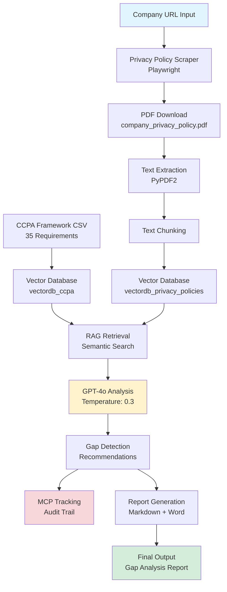
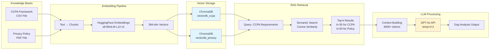
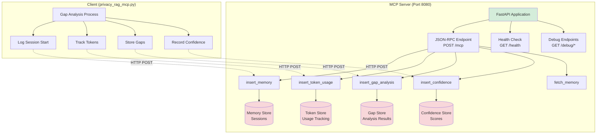
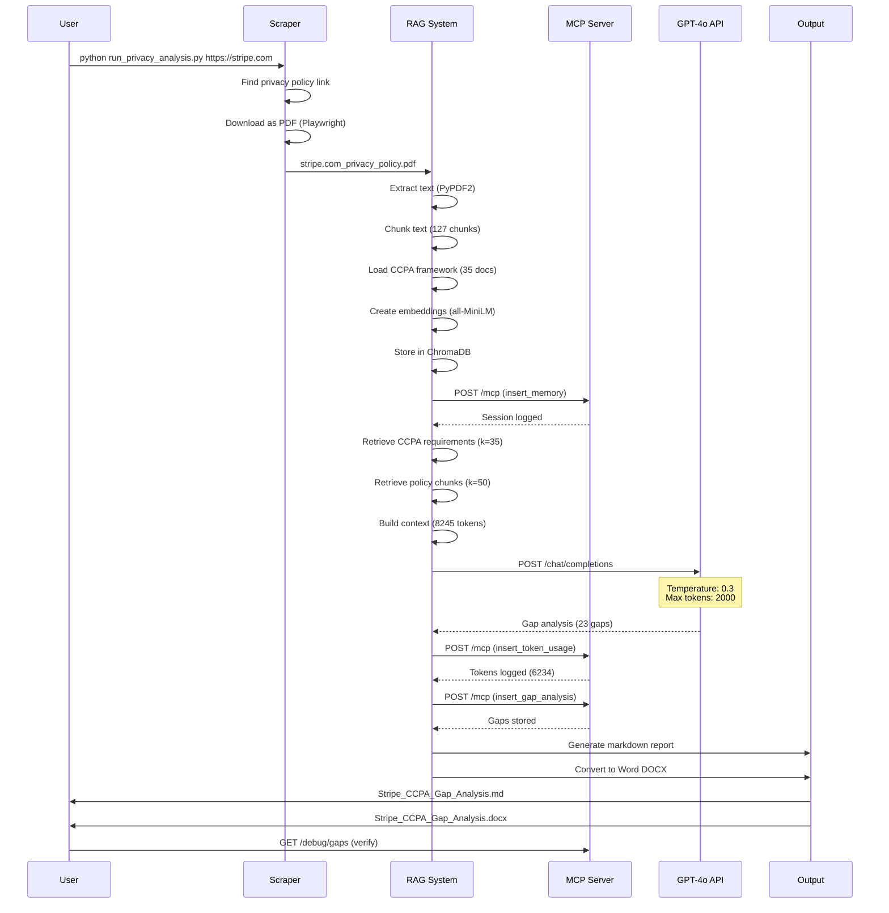
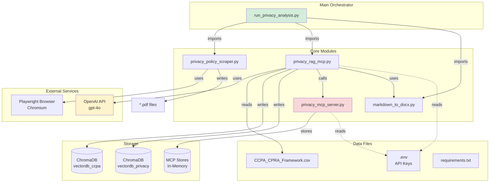
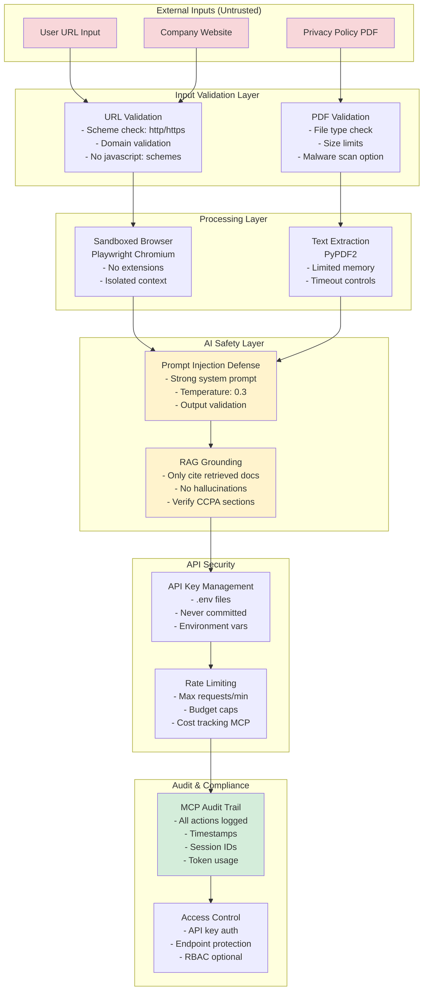

# Privacy Gap Analysis System - Mermaid Diagrams

**Renderable in GitHub, VS Code, and diagram tools**

---

## Diagram 1: High-Level System Flow

---

## Diagram 2: RAG Architecture Detail

---

## Diagram 3: MCP Server Architecture

---

## Diagram 4: End-to-End Sequence

---

## Diagram 5: Component Dependencies

---

## Diagram 6: Data Flow Timeline

```mermaid
gantt
    title Privacy Gap Analysis Timeline
    dateFormat ss
    axisFormat %S sec

    section Scraping
    Find privacy link    :a1, 00, 5s
    Download PDF         :a2, after a1, 8s

    section Extraction
    Parse PDF            :b1, after a2, 3s
    Chunk text           :b2, after b1, 1s

    section Vector DB
    Load CCPA framework  :c1, after b2, 2s
    Embed policy chunks  :c2, after c1, 5s

    section RAG
    Retrieve CCPA        :d1, after c2, 1s
    Retrieve policy      :d2, after d1, 1s
    Build context        :d3, after d2, 1s

    section AI Analysis
    GPT-4o API call      :e1, after d3, 15s
    Parse response       :e2, after e1, 1s

    section MCP Tracking
    Log session          :f1, after e2, 1s
    Log tokens           :f2, after f1, 1s
    Log gaps             :f3, after f2, 1s

    section Report
    Generate markdown    :g1, after f3, 2s
    Convert to Word      :g2, after g1, 3s
```

---

## Diagram 7: Security Architecture

---

## How to Use These Diagrams

### Rendering Options:

1. **GitHub** - Mermaid renders automatically in `.md` files
2. **VS Code** - Install "Markdown Preview Mermaid Support" extension
3. **Mermaid Live Editor** - https://mermaid.live/
4. **Export to PNG/SVG** - Use mermaid-cli or online editor
5. **PowerPoint** - Screenshot or use mermaid-to-pptx tools

### For LinkedIn Learning Slides:

1. Copy diagram code to Mermaid Live Editor
2. Adjust theme/colors as needed
3. Export as PNG (high resolution)
4. Import into PowerPoint slide
5. Add annotations and labels

### Recommended Diagrams per Chapter:

| Chapter | Primary Diagram | Secondary Diagram |
|---------|-----------------|-------------------|
| **0: Intro** | Diagram 1 (High-Level Flow) | Diagram 4 (Sequence) |
| **1: AI Security** | Diagram 1 + Stats | Diagram 7 (Security) |
| **2: RAG Basics** | Diagram 2 (RAG Architecture) | Diagram 5 (Dependencies) |
| **2: MCP** | Diagram 3 (MCP Server) | Diagram 4 (Sequence) |
| **3: Gap Analysis** | Diagram 4 (Sequence) | Diagram 6 (Timeline) |
| **5: System Design** | Diagram 5 (Dependencies) | Diagram 7 (Security) |

---

**Repository:** https://github.com/Blodgic/CADDIE_RAG_MPC
